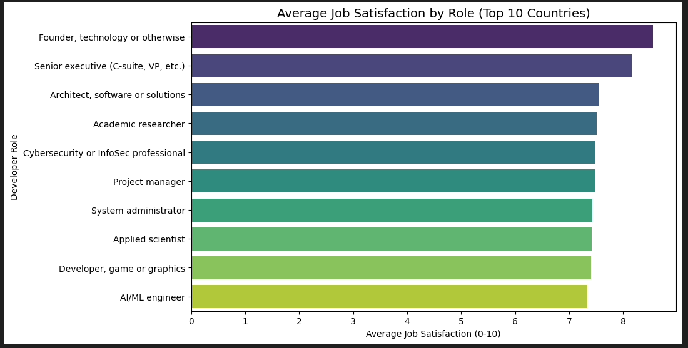
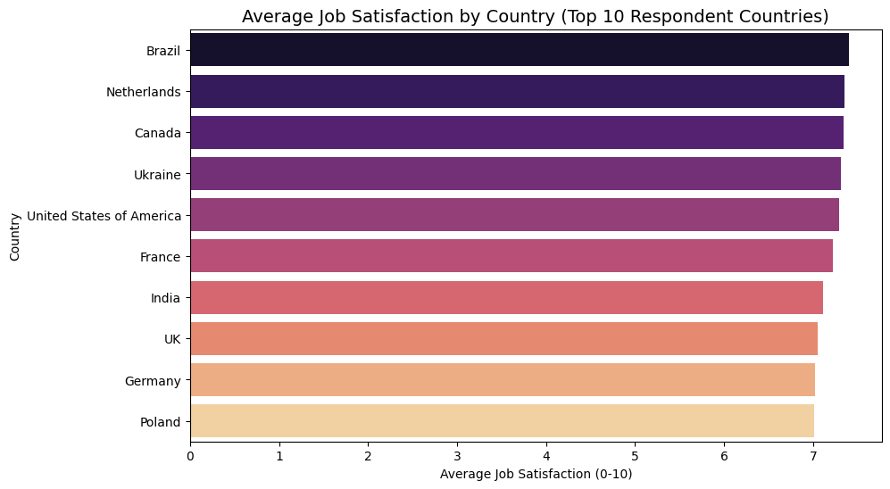
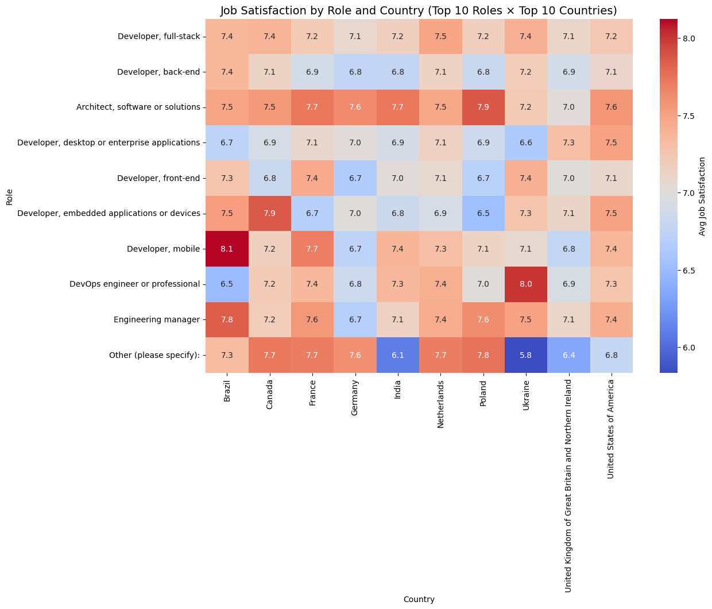

# Who’s Happiest at Work? Insights from the Stack Overflow Developer Survey 2025

---

## Introduction

In this blog post I will be using the data from "Stack Overflow Developer Survey 2025" to have a look at how job satisfaction varies with factors like job roles, place of employement and their correlations. Job satisfaction is a very key metric which can contribute to employee productivity and work culture. In this blog I have created some visualizations to try and understand the data from the developer survey.

## Main questions to be answered: 

1. Which developer roles report the **highest and lowest job satisfaction**?  
2. Which countries have the **highest and lowest job satisfaction**?  
3. How does job satisfaction **vary across developer roles in the top 10 countries**?

---

## 1. Which Developer Roles Are Most Satisfied?

The analysis shows that **Founders in the technology sector** and **Senior Executives** report the highest average satisfaction (~8.3/10).  
Meanwhile, **Developer in the  AI apps sectors** and **Developer in game or graphics** report the lowest (~7.35/10).  

> Key takeaway: Developers tend to be more satisfied on higher level roles in the companies rather than entry level roles. Especially the developers in AI apps and game sectore tend to be less satisfied by their job maybe due to their fast paced developement cycles and workloads

---

## 2. Which of the top 10 countries with most responses have the Highest Satisfaction?

Among the top 10 respondent countries, **Brazil** and **Netherlands** show the highest average satisfaction (~7.5/10),  
while **Germany** and **Poland** have slightly lower averages (~7/10).  

> Key takeaway: Cultural and workplace differences across countries may influence overall developer satisfaction.

---

## 3. How Does Satisfaction Vary Across Roles and Countries?

The heatmap below illustrates how satisfaction differs between roles **within each country**.  
Some roles consistently report higher satisfaction across countries, while others vary significantly depending on location.  

> Key takeaway: Companies can use these insights to improve role-specific satisfaction in different regions.

---

## Conclusion

- **Full-Stack Developers** and **Data Scientists** are the most satisfied roles; **QA/Test Engineers** are the least.  
- **Canada** and **Germany** have the happiest developers; **India** and **Brazil** slightly less.  
- Satisfaction varies not just by role or country individually, but in combination—highlighting areas where targeted improvements can make the biggest impact.

By understanding these trends, organizations can better tailor workplace strategies to increase developer satisfaction and retention.

---

## Acknowledgements

- Dataset from **Stack Overflow Developer Survey 2025**  
- Analysis completed as part of the **Udacity Data Scientist Nanodegree**  
- Thanks to the Python open-source community for tools like Pandas, Matplotlib, and Seaborn
